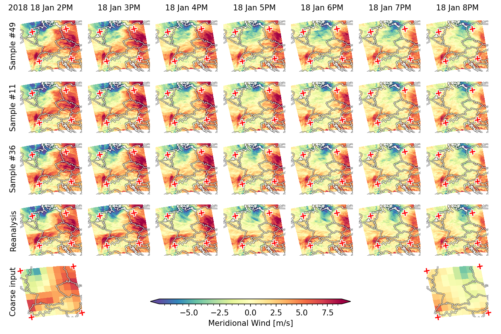

Wouldn't it be nice, if you could...

# Predict weather from climate

This code accompanies the paper "Spatiotemporally Coherent Probabilistic Generation of Weather from Climate" (link to pre-print follows soon).

  

This repository contains the code to reproduce the results of the paper.
More information follows soon...

### Acknowledgements

The model and code extends [Score-Based Data Assimilation](https://github.com/francois-rozet/sda) by François Rozet et al.
Some training utility is adopted from the [EDM2 Repository](https://github.com/NVlabs/edm2/tree/main) by Tero Karras et al.