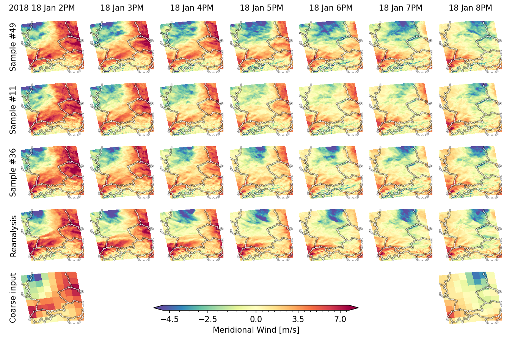

Wouldn't it be nice, if you could...

# Predict weather from climate

This code accompanies the paper **"A Generative Framework for Probabilistic, Spatiotemporally Coherent Downscaling of Climate Simulation"**, which can be found [here](https://www.nature.com/articles/s41612-025-01157-y) ➡️ `https://www.nature.com/articles/s41612-025-01157-y`

<p align="center">
  
</p>

This repository contains the code to reproduce the results of the paper.
Please find information on...
- ...data processing
- ...loading trained models
- ...loading results used in the paper
- ...training the model yourself
- ...etc.

...below!


## Setup ⚙️

> 👋 **Just a quick note before you start:**<br>
> I have tested the code<br>
> a) on a local linux machine with one NVIDIA 2080 and <br>
> b) on a SLURM cluster using multiple NVIDIA {2080/A100} GPUs.<br>
> Of course, even though I try to provide as much of an out-of-the-box setup, as possible, it is certainly possible that you encounter problems on your local machine/setup/cluster/...
> Please let me know if you have suggestions/problems/solutions by opening an issue in this repository! Thank you!

Please start by
1. setting up the python environment
```bash
pip install -r requirements.txt
```
2. cloning this repository
```bash
git clone https://github.com/schmidtjonathan/Climate2Weather.git
```
3. and installing some basic functionalities
```bash
cd Climate2Weather
pip install -e .
```

## Have a look yourself: Climate-Informed Weather Dynamics 🌦️

The downscaled climate simulations for the year 2014, which are evaluated in the paper, are accessible [here (huggingface)](https://huggingface.co/datasets/schmidtjonathan/C2W_downscaled-2014/tree/main) ➡️ `https://huggingface.co/datasets/schmidtjonathan/C2W_downscaled-2014`

Please feel encouraged to load, analyze and use the climate-informed weather simulations!
- Are they useful for you and your research? Amazing! Please let me know and please cite our paper when you use our results 🚀
- Are there problems; either with loading the data or with using it? Do you have feedback? Please do not hesitate to let me know, e.g., by opening an issue in this repository! Thank you!
I am very interested in hearing your opinion!


## Convince yourself: load the trained model 💪

To reproduce all results from the experiments by drawing your own samples, please download the pickled model (and/or the training state) from [here (huggingface)](https://huggingface.co/schmidtjonathan/C2W_model/tree/main) ➡️ `https://huggingface.co/schmidtjonathan/C2W_model/tree/main`

Please feel encouraged to load the model and to use it for your own experiments! And do not hesitate to share your opinion or questions via e-mail or by opening an issue in this repository! Thank you!


## Citation

If you find our code, results, model, data, etc. useful for your own endeavors, please consider citing our work:

```
@article{Schmidt2025,
  author       = {Jonathan Schmidt and Luca Schmidt and Felix M. Strnad and Nicole Ludwig and Philipp Hennig},
  title        = {A Generative Framework for Probabilistic, Spatiotemporally Coherent Downscaling of Climate Simulation},
  journal      = {npj Climate and Atmospheric Science},
  year         = {2025},
  volume       = {8},
  number       = {1},
  pages        = {270},
  doi          = {10.1038/s41612-025-01157-y},
  url          = {https://doi.org/10.1038/s41612-025-01157-y},
  issn         = {2397-3722}
}
```

---

### Acknowledgements

The model and code extends [Score-Based Data Assimilation](https://github.com/francois-rozet/sda) by François Rozet et al.
Some training utility is adopted from the [EDM2 Repository](https://github.com/NVlabs/edm2/tree/main) by Tero Karras et al.